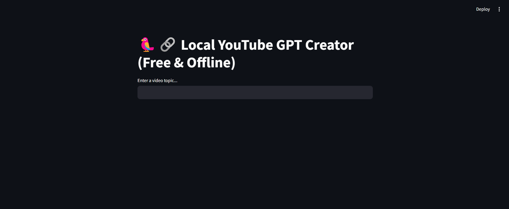

# 🦜🔗 Local YouTube GPT Creator

A fully local and cost-free YouTube video script generator using **quantized open-source LLMs** via [`ctransformers`](https://github.com/marella/ctransformers) and [`LangChain`](https://www.langchain.com/), powered by [Streamlit](https://streamlit.io).

## 🔥 Features

- ✅ Generate catchy **YouTube titles** from any topic
- ✅ Create engaging **video scripts** using Wikipedia summaries
- ✅ Runs **100% locally** (no OpenAI API required)
- ✅ Supports **quantized GGUF models** (e.g., Mistral-7B)
- ✅ Memory-enabled with **LangChain** for persistent context
- ✅ Easy-to-use **Streamlit interface**

---

## Download a quantized model
Download a .gguf file (e.g., Mistral-7B-Instruct) from [TheBloke](https://huggingface.co/TheBloke/Mistral-7B-Instruct-v0.1-GGUF) on Hugging Face. Place it in the project directory.

## 🖥️ Demo



---

## 🚀 Getting Started

### 1. Clone the repo

```bash
git clone https://github.com/your-username/youtube-gpt-local.git
cd youtube-gpt-local
